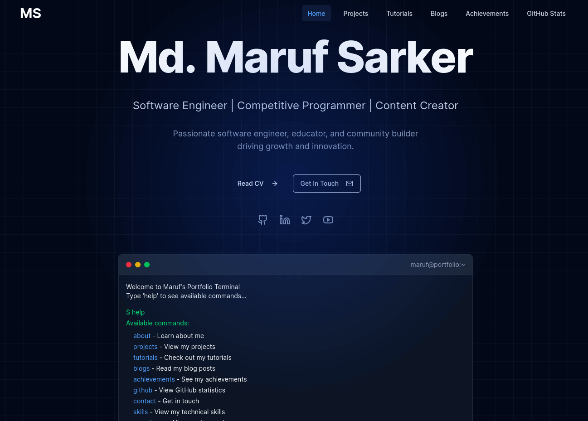

# Developer Portfolio - Maruf Sarker

A modern, responsive developer portfolio website built with Next.js 15, featuring a unique terminal interface, glassmorphism design, GitHub statistics, and smooth animations.



## 🚀 Features

### Core Features

- **Interactive Terminal Interface**: Mac-style terminal with comprehensive command-line navigation
- **Glassmorphism Design**: Modern glass-like UI elements with backdrop blur effects
- **Grid Background Pattern**: Professional dark gradient background with subtle grid patterns
- **Mouse Movement Effects**: Dynamic background gradients that follow cursor movement
- **Responsive Design**: Fully responsive across all device sizes
- **Smooth Animations**: Framer Motion powered animations and transitions
- **Jump to Top Button**: Easy navigation on all pages
- **SEO Optimized**: Comprehensive meta tags and structured data

### Pages & Sections

- **Home Page**: Terminal interface, about section, featured projects, tutorials, blogs, and contact
- **Projects Page**: Category-wise project filtering with smooth animations
- **Tutorials Page**: YouTube tutorial listings with embedded player options
- **Blogs Page**: External blog integration with redirect functionality
- **Achievements Page**: Full-width certificate display with PDF view buttons
- **GitHub Stats Page**: Comprehensive GitHub activity, contribution graphs, and statistics
- **Footer**: Professional footer with social links and quick navigation

### Technical Features

- **Dynamic Routing**: Next.js App Router with dynamic pages for tutorials
- **External Blog Integration**: Seamless redirection to external blog application
- **GitHub API Integration**: Real-time GitHub statistics and activity graphs
- **Certificate Management**: PDF certificate viewing functionality
- **Enhanced Terminal**: Linux commands support with command history
- **Performance Optimized**: Next.js Image optimization and lazy loading
- **TypeScript**: Full type safety throughout the application

## 🛠️ Tech Stack

- **Framework**: Next.js 15 (App Router)
- **Language**: TypeScript
- **Styling**: Tailwind CSS with custom grid patterns
- **UI Components**: shadcn/ui
- **Animations**: Framer Motion
- **Icons**: Lucide React
- **GitHub Integration**: GitHub API and third-party stat services

## 📁 Project Structure

```txt
📦maruf
┣ 📦public
┣ 📦src
┣ ┣ 📂app
┣ ┃ ┣ 📂achievements
┣ ┃ ┃ ┗ 📜page.tsx
┣ ┃ ┣ 📂blogs
┣ ┃ ┃ ┗ 📜page.tsx
┣ ┃ ┣ 📂github
┣ ┃ ┃ ┗ 📜page.tsx
┣ ┃ ┣ 📂projects
┣ ┃ ┃ ┗ 📜page.tsx
┣ ┃ ┣ 📂tutorials
┣ ┃ ┃ ┣ 📂[id]
┣ ┃ ┃ ┃ ┗ 📜page.tsx
┣ ┃ ┃ ┗ 📜page.tsx
┣ ┃ ┣ 📜favicon.ico
┣ ┃ ┣ 📜globals.css
┣ ┃ ┣ 📜layout.tsx
┣ ┃ ┗ 📜page.tsx
┣ ┣ 📂components
┣ ┃ ┣ 📂ui
┣ ┃ ┣ 📜footer.tsx
┣ ┃ ┣ 📜glassmorphism-card.tsx
┣ ┃ ┣ 📜jump-to-top.tsx
┣ ┃ ┣ 📜mouse-move-effect.tsx
┣ ┃ ┣ 📜navbar.tsx
┣ ┃ ┣ 📜terminal.tsx
┣ ┃ ┗ 📜theme-provider.tsx
┣ ┣ 📂db
┣ ┃ ┣ 📜achievements.ts
┣ ┃ ┣ 📜blogs.ts
┣ ┃ ┣ 📜projects.ts
┣ ┃ ┗ 📜tutorials.ts
┣ ┣ 📂hooks
┣ ┃ ┣ 📜use-mobile.tsx
┣ ┃ ┗ 📜use-toast.ts
┣ ┣ 📂lib
┣ ┃ ┣ 📜data.ts
┣ ┃ ┗ 📜utils.ts
```

## 🎯 Key Components

### Enhanced Terminal Component

- Interactive command-line interface with 20+ commands
- Mac-style window design with authentic terminal experience
- Linux command support (ls, pwd, whoami, date, uname, history)
- Command history navigation with arrow keys
- Portfolio-specific commands for navigation
- Real-time input handling and command processing

### GitHub Statistics Page

- Comprehensive GitHub activity overview
- Real-time contribution graphs and heatmaps
- Top repositories showcase with language statistics
- Competitive programming stats (LeetCode, Codeforces)
- GitHub trophies and achievement display
- Interactive statistics cards with animations

### Grid Background Pattern

- Professional dark gradient background
- Subtle grid overlay for enhanced visual appeal
- Multiple grid sizes for different sections
- CSS-based implementation for optimal performance

### Certificate Management

- Full-width certificate image display
- PDF viewing functionality for each achievement
- Professional achievement showcase layout
- Direct certificate download/view buttons

### External Blog Integration

- Seamless redirection to external blog application
- Maintained blog metadata and preview functionality
- External link indicators for user clarity
- Consistent design with portfolio theme

## 🚀 Getting Started

### Prerequisites

- Node.js 18+
- npm or yarn package manager

### Installation

1. **Clone the repository**

   ```bash
   git clone https://github.com/maruf-pfc/maruf.git
   cd maruf
   ```

2. **Install dependencies**

   ```bash
   pnpm install
   ```

3. **Run the development server**

   ```bash
   pnpm run dev
   ```

4. **Open your browser**
   Navigate to [http://localhost:3000](http://localhost:3000)

### Building for Production

```bash
pnpm run build
pnpm start
```

## 🎨 Customization

### Adding New Content

1. **Projects**: Edit `db/projects.ts`
2. **Tutorials**: Edit `db/tutorials.ts`
3. **Blogs**: Edit `db/blogs.ts` with external URLs
4. **Achievements**: Edit `db/achievements.ts` and add certificates to `public/certificates/`

### Styling Customization

- **Grid Patterns**: Modify grid classes in `globals.css`
- **Colors**: Update Tailwind config in `tailwind.config.ts`
- **Glassmorphism**: Adjust opacity and blur in `components/glassmorphism-card.tsx`
- **Animations**: Customize Framer Motion animations in respective components

### Terminal Commands

Add new commands in `components/terminal.tsx`:

```typescript
case "newcommand":
  output = "Your custom output here"
  break
```

### GitHub Integration

Update GitHub username in `app/github/page.tsx`:

```typescript
const githubStats = {
  username: "your-github-username",
  // ... other stats
};
```

## 📱 Responsive Design

The portfolio is fully responsive with breakpoints:

- **Mobile**: < 768px
- **Tablet**: 768px - 1024px
- **Desktop**: > 1024px

Key responsive features:

- Collapsible navigation menu
- Responsive grid layouts with grid patterns
- Touch-friendly terminal interactions
- Optimized typography scaling
- Mobile-optimized GitHub statistics

## ⚡ Performance Optimizations

- **Next.js Image Optimization**: Automatic image optimization and lazy loading
- **Code Splitting**: Automatic code splitting with Next.js App Router
- **Static Generation**: Pre-rendered pages for better performance
- **Efficient Animations**: Hardware-accelerated CSS transforms
- **Optimized Fonts**: Google Fonts optimization with Next.js
- **CSS Grid Patterns**: Lightweight CSS-based background patterns

## 🔧 Development

### Adding New Pages

1. Create new page in `app/` directory
2. Add route to navigation in `components/navbar.tsx`
3. Update data functions in `lib/data.ts` if needed
4. Add to footer quick links in `components/footer.tsx`

### Component Development

- Use TypeScript for type safety
- Follow the existing glassmorphism design patterns
- Implement responsive design with Tailwind CSS
- Add proper accessibility attributes
- Include Framer Motion animations for consistency

## 📧 Contact Integration

The contact form is set up to send emails to: `mdmarufsarker.mms@gmail.com`

To implement actual email functionality:

1. Add a form handler API route in `app/api/contact/route.ts`
2. Integrate with email service (SendGrid, Nodemailer, etc.)
3. Add form validation and error handling
4. Implement success/error notifications

## 🌟 Features in Detail

### Enhanced Terminal Interface

- **20+ Commands**: Comprehensive command set including Linux commands
- **Command History**: Navigate through previous commands with arrow keys
- **Portfolio Navigation**: Direct links to all portfolio sections
- **System Information**: Mock system info commands for authenticity
- **Interactive Help**: Detailed help system with command descriptions

### GitHub Statistics Integration

- **Real-time Data**: Live GitHub statistics and contribution data
- **Visual Graphs**: Contribution heatmaps and activity graphs
- **Repository Showcase**: Top repositories with language statistics
- **Competitive Programming**: LeetCode and Codeforces integration
- **Achievement Display**: GitHub trophies and badges

### Professional Certificate Display

- **Full-width Images**: Professional certificate image display
- **PDF Integration**: Direct certificate viewing and download
- **Achievement Categories**: Organized by certification, award, recognition
- **Issuer Information**: Detailed issuer and date information

### External Blog Integration

- **Seamless Redirection**: Smooth transition to external blog application
- **Consistent Design**: Maintained portfolio design language
- **Preview Functionality**: Blog previews with metadata
- **External Indicators**: Clear indication of external links

## 🚀 Deployment

### Vercel (Recommended)

1. Push code to GitHub
2. Connect repository to Vercel
3. Add environment variables if needed
4. Deploy automatically

### Other Platforms

- **Netlify**: Static site deployment with form handling
- **AWS Amplify**: Full-stack deployment with API integration
- **GitHub Pages**: Static deployment (limited functionality)

## 🔒 Security Considerations

- **Environment Variables**: Secure API keys and tokens
- **External Links**: Proper `rel="noopener noreferrer"` attributes
- **Input Validation**: Sanitized form inputs
- **HTTPS**: Enforced secure connections
- **Content Security Policy**: Implemented CSP headers

## 🤝 Contributing

1. Fork the repository
2. Create a feature branch (`git checkout -b feature/amazing-feature`)
3. Commit your changes (`git commit -m 'Add amazing feature'`)
4. Push to the branch (`git push origin feature/amazing-feature`)
5. Open a Pull Request

## 📄 License

This project is open source and available under the [Apache License](LICENSE).

## 👨‍💻 About the Developer

**Md. Maruf Sarker**

- 🚀 Full Stack Developer & Competitive Programmer
- 🏢 Community Manager at Stack Learner
- 📱 Social Media Manager at CPS Academy
- 📺 Content Creator and YouTuber
- 🎓 Computer Science & Engineering Student
- 🌟 Founder of Programming for Career

### Professional Experience

- **Stack Learner** - Community Manager (Jan 2025 - May 2025)
- **Stack Learner** - Social Media Manager (Aug 2023 - Dec 2024)
- **CPS Academy** - Social Media Manager (Apr 2023 - Present)
- **Beecrowd** - Content Creator (Feb 2022 - Present)

### Technical Skills

- **Languages**: C, C++, Java, JavaScript, Python, TypeScript
- **Frontend**: HTML, CSS, React, Next.js, Tailwind CSS
- **Backend**: Node.js, Express.js, MongoDB, MySQL, PostgreSQL
- **Tools**: Git, Docker, VSCode, Postman, Linux

### Connect with Me

- **Email**: mdmarufsarker.mms@gmail.com
- **GitHub**: [github.com/maruf-pfc](https://github.com/maruf-pfc)
- **LinkedIn**: [linkedin.com/in/mdmarufsarker](https://linkedin.com/in/mdmarufsarker)
- **Twitter**: [twitter.com/md_marufsarker](https://twitter.com/md_marufsarker)
- **YouTube**: [youtube.com/@maruf_sarker](https://youtube.com/@maruf_sarker)

### Competitive Programming Profiles

- **Codeforces**: [codeforces.com/profile/maruf_sarker](https://codeforces.com/profile/maruf_sarker)
- **LeetCode**: [leetcode.com/mdmarufsarker](https://leetcode.com/mdmarufsarker)
- **HackerRank**: [hackerrank.com/mdmarufsarker](https://hackerrank.com/mdmarufsarker)

---

Built with ❤️ using Next.js 15, TypeScript, Tailwind CSS, and modern web technologies.

**Latest Updates:**

- ✅ Grid background patterns
- ✅ Enhanced terminal with Linux commands
- ✅ GitHub statistics page
- ✅ External blog integration
- ✅ Full-width certificate display
- ✅ Professional footer
- ✅ Comprehensive SEO optimization
- ✅ Button enhancements for tutorials and blogs
- ✅ Command history in terminal
- ✅ Responsive design improvements
